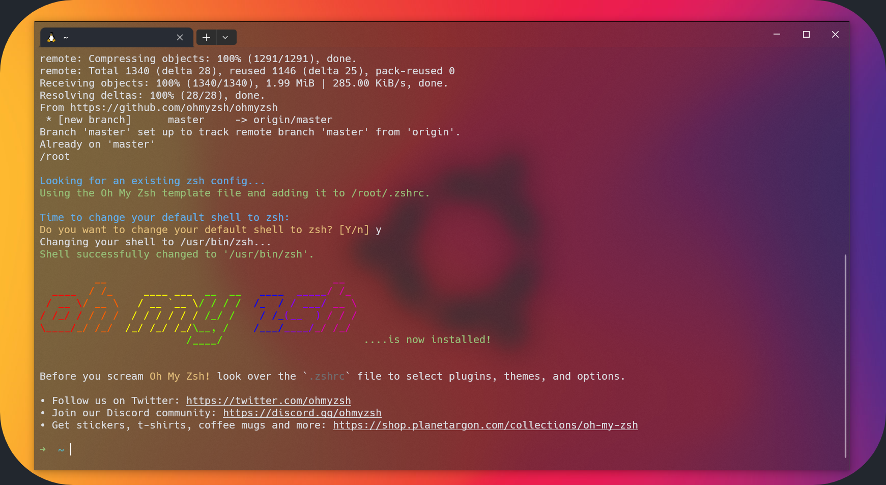

# Zsh, Oh My Zsh, Powerlevel10k, and Plugin Setup for WSL2, Linux, and macOS



This guide installs and configures Zsh, Oh My Zsh, Powerlevel10k, Nerd Fonts, and a practical plugin set:

```zsh
plugins=(git zsh-autosuggestions z fzf zsh-syntax-highlighting)
```

It is written for:

- Windows 10/11 with WSL2
- Linux
- macOS

> [!IMPORTANT]
> On Windows, this guide assumes you are using Zsh **inside WSL2**.
> Windows Terminal and fonts are installed on the Windows host.
> Shell tools such as `git`, `curl`, `zsh`, `fzf`, Oh My Zsh, Powerlevel10k, and Zsh plugins are installed inside the WSL2 Linux distribution.

## Supported Environments

| Environment | Run shell commands where? | Notes |
| --- | --- | --- |
| Windows + WSL2 | Inside the WSL2 Linux shell | Install Windows Terminal and fonts on Windows; install CLI tools inside WSL2. |
| Linux | Native Linux terminal | Use your distribution's package manager. |
| macOS | Native macOS terminal | Homebrew is recommended. |
| Windows native PowerShell | PowerShell | Only use Windows package commands if you also want `fzf` outside WSL2. |

> [!WARNING]
> Installing `fzf` on Windows with `winget`, `scoop`, or `choco` does **not** install it inside WSL2.
> If your Zsh runs inside WSL2, install `fzf` inside WSL2.

## Prerequisites

### Windows / WSL2

- Windows 10 or newer, or Windows 11
- WSL2 enabled
- A Linux distribution installed in WSL2, such as Ubuntu or Debian
- Windows Terminal recommended
- A Nerd Font installed on Windows

### Linux

- A terminal emulator such as GNOME Terminal, Konsole, Kitty, Alacritty, WezTerm, Ghostty, or similar
- A supported package manager such as `apt`, `dnf`, `pacman`, or `zypper`
- A Nerd Font installed on your Linux desktop if using Powerlevel10k icons

### macOS

- Terminal.app, iTerm2, WezTerm, Ghostty, Kitty, or another terminal emulator
- Homebrew recommended
- A Nerd Font installed on macOS

## Install Windows Terminal

For Windows / WSL2 users, install Windows Terminal from Microsoft:

<https://learn.microsoft.com/windows/terminal/install>

Linux and macOS users can skip this step.

## Install a Nerd Font

Powerlevel10k works best with a Nerd Font. `MesloLGS NF` is a safe default for Powerlevel10k.

You can download Nerd Fonts from:

<https://www.nerdfonts.com/>

For Powerlevel10k's recommended Meslo font, install these four files:

- `MesloLGS NF Regular.ttf`
- `MesloLGS NF Bold.ttf`
- `MesloLGS NF Italic.ttf`
- `MesloLGS NF Bold Italic.ttf`

### Windows Terminal

Install the font on Windows, then configure Windows Terminal:

```text
Settings -> Defaults -> Appearance -> Font face -> MesloLGS NF
```

For WSL2, install the font on Windows, not inside WSL2.

### Linux terminal

Install the font on Linux and configure your terminal profile to use `MesloLGS NF`.

The exact menu depends on your terminal emulator.

### macOS terminal

Install the font on macOS and configure Terminal.app, iTerm2, WezTerm, Ghostty, Kitty, or your terminal app to use `MesloLGS NF`.

## Install Required Packages

Install `git`, `curl`, `zsh`, and `fzf` for your environment.

### Ubuntu / Debian / WSL Ubuntu

Run this inside Ubuntu, Debian, or Ubuntu WSL2:

```bash
sudo apt update
sudo apt install -y git curl zsh fzf
```

### Fedora

```bash
sudo dnf install -y git curl zsh fzf
```

### Arch Linux / Manjaro

```bash
sudo pacman -Syu --needed git curl zsh fzf
```

### openSUSE

```bash
sudo zypper install git curl zsh fzf
```

### macOS

macOS includes Zsh by default. Install the required tools with Homebrew:

```bash
brew install git curl fzf
```

If you want to use the Homebrew version of Zsh instead of the system Zsh:

```bash
brew install zsh
```

### Optional: Windows-native fzf

Only use this section if you also want `fzf` in PowerShell, Command Prompt, or Git Bash on Windows.
This is separate from installing `fzf` inside WSL2.

Using Winget:

```powershell
winget install fzf
```

Using Scoop:

```powershell
scoop install fzf
```

Using Chocolatey:

```powershell
choco install fzf
```

## Set Zsh as the Default Shell

Check where Zsh is installed:

```bash
which zsh
```

Set Zsh as your default shell:

```bash
chsh -s "$(which zsh)"
```

Then close and reopen your terminal.

On some WSL2 distributions, you may need:

```bash
sudo chsh -s "$(which zsh)" "$USER"
```

On macOS, the default shell is usually already Zsh. If you installed Zsh with Homebrew and want to use that version, make sure it is listed in `/etc/shells` before using `chsh`.

## Install Oh My Zsh

Install Oh My Zsh with the official install script:

```bash
sh -c "$(curl -fsSL https://raw.githubusercontent.com/ohmyzsh/ohmyzsh/master/tools/install.sh)"
```

If you prefer to inspect the script before running it:

```bash
curl -fsSL https://raw.githubusercontent.com/ohmyzsh/ohmyzsh/master/tools/install.sh -o install-oh-my-zsh.sh
less install-oh-my-zsh.sh
sh install-oh-my-zsh.sh
```

> [!NOTE]
> The Oh My Zsh installer may rename an existing `.zshrc` to `.zshrc.pre-oh-my-zsh`.
> Review that file if you had custom shell settings before installation.

## Install Powerlevel10k

Install the Powerlevel10k theme into the Oh My Zsh custom themes directory.

This command is safe to run more than once; it skips cloning if the theme already exists.

```bash
ZSH_CUSTOM="${ZSH_CUSTOM:-$HOME/.oh-my-zsh/custom}"

if [ ! -d "$ZSH_CUSTOM/themes/powerlevel10k" ]; then
  git clone --depth=1 https://github.com/romkatv/powerlevel10k.git \
    "$ZSH_CUSTOM/themes/powerlevel10k"
fi
```

## Enable Powerlevel10k

Before editing `~/.zshrc`, create a backup:

```bash
[ -f ~/.zshrc ] && cp ~/.zshrc ~/.zshrc.backup.$(date +%Y%m%d%H%M%S)
```

Edit your `~/.zshrc` file:

```bash
vi ~/.zshrc
```

Find this line:

```zsh
ZSH_THEME="robbyrussell"
```

Replace it with:

```zsh
ZSH_THEME="powerlevel10k/powerlevel10k"
```

Reload Zsh:

```bash
source ~/.zshrc
```

Or close and reopen your terminal.

## Install and Enable Zsh Plugins

This setup uses the following plugins:

```zsh
plugins=(git zsh-autosuggestions z fzf zsh-syntax-highlighting)
```

### Plugin overview

| Plugin | Purpose | Installation |
| --- | --- | --- |
| `git` | Git aliases and helpers | Built into Oh My Zsh |
| `zsh-autosuggestions` | Suggests commands as you type | Requires manual clone |
| `z` | Jump to frequently used directories | Built into Oh My Zsh |
| `fzf` | Fuzzy finder integration | Requires the `fzf` command-line tool |
| `zsh-syntax-highlighting` | Highlights commands while typing | Requires manual clone |

> [!IMPORTANT]
> Keep `zsh-syntax-highlighting` as the last plugin in the list.
> It hooks into Zsh command rendering and should be loaded after other plugins.

### Install external plugins

Install `zsh-autosuggestions` and `zsh-syntax-highlighting` into the Oh My Zsh custom plugins directory.

These commands are safe to run more than once; they skip cloning if the plugin directory already exists.

```bash
ZSH_CUSTOM="${ZSH_CUSTOM:-$HOME/.oh-my-zsh/custom}"

if [ ! -d "$ZSH_CUSTOM/plugins/zsh-autosuggestions" ]; then
  git clone https://github.com/zsh-users/zsh-autosuggestions \
    "$ZSH_CUSTOM/plugins/zsh-autosuggestions"
fi

if [ ! -d "$ZSH_CUSTOM/plugins/zsh-syntax-highlighting" ]; then
  git clone https://github.com/zsh-users/zsh-syntax-highlighting.git \
    "$ZSH_CUSTOM/plugins/zsh-syntax-highlighting"
fi
```

### Enable plugins

Edit your `~/.zshrc` file:

```bash
vi ~/.zshrc
```

Replace the default plugin line:

```zsh
plugins=(git)
```

with:

```zsh
plugins=(git zsh-autosuggestions z fzf zsh-syntax-highlighting)
```

Then reload Zsh:

```bash
source ~/.zshrc
```

> [!NOTE]
> Because this guide enables the Oh My Zsh `fzf` plugin, you usually do not need to add `source <(fzf --zsh)` manually.
> If you do not use the Oh My Zsh `fzf` plugin, you can use fzf's native shell integration instead.

## Configure Powerlevel10k

Run the Powerlevel10k configuration wizard:

```bash
p10k configure
```

Choose the style you prefer. If icons look broken, re-check your Nerd Font installation and terminal font setting.

## Verify Installation

Run these commands in the same shell where Zsh is installed:

```bash
zsh --version
git --version
curl --version
fzf --version
echo "$SHELL"
```

Check Oh My Zsh:

```bash
test -d "$HOME/.oh-my-zsh" && echo "Oh My Zsh installed"
```

Check Powerlevel10k:

```bash
test -d "${ZSH_CUSTOM:-$HOME/.oh-my-zsh/custom}/themes/powerlevel10k" && echo "Powerlevel10k installed"
```

Check custom plugins:

```bash
test -d "${ZSH_CUSTOM:-$HOME/.oh-my-zsh/custom}/plugins/zsh-autosuggestions" && echo "zsh-autosuggestions installed"
test -d "${ZSH_CUSTOM:-$HOME/.oh-my-zsh/custom}/plugins/zsh-syntax-highlighting" && echo "zsh-syntax-highlighting installed"
```

Check `.zshrc` settings:

```bash
grep '^ZSH_THEME=' ~/.zshrc
grep '^plugins=' ~/.zshrc
```

Expected values:

```zsh
ZSH_THEME="powerlevel10k/powerlevel10k"
plugins=(git zsh-autosuggestions z fzf zsh-syntax-highlighting)
```

Try these features:

| Feature | Test |
| --- | --- |
| Powerlevel10k | Run `p10k configure`. |
| Autosuggestions | Type a command you used before and check for a gray suggestion. |
| Syntax highlighting | Type a valid command and then an invalid command. |
| `z` | Visit a directory, leave it, then run `z <partial-directory-name>`. |
| `fzf` | Press `Ctrl + R` to search shell history. |

## Agent-Friendly Installation Checklist

Use this checklist if an automated agent or script is following this guide.

1. Detect the environment before running commands.
   - WSL2: run Linux commands inside WSL2.
   - Native Linux: use the distribution package manager.
   - macOS: use Homebrew commands.
   - Windows native package managers are only for Windows-native shells, not WSL2.
2. Install required command-line tools: `git`, `curl`, `zsh`, and `fzf`.
3. Install Oh My Zsh.
4. Install Powerlevel10k into:

   ```bash
   ${ZSH_CUSTOM:-$HOME/.oh-my-zsh/custom}/themes/powerlevel10k
   ```

5. Install external plugins into:

   ```bash
   ${ZSH_CUSTOM:-$HOME/.oh-my-zsh/custom}/plugins
   ```

6. Back up `~/.zshrc` before editing:

   ```bash
   [ -f ~/.zshrc ] && cp ~/.zshrc ~/.zshrc.backup.$(date +%Y%m%d%H%M%S)
   ```

7. Ensure `~/.zshrc` contains:

   ```zsh
   ZSH_THEME="powerlevel10k/powerlevel10k"
   plugins=(git zsh-autosuggestions z fzf zsh-syntax-highlighting)
   ```

8. Keep `zsh-syntax-highlighting` last in the plugin list.
9. Verify installation with the commands in the [Verify Installation](#verify-installation) section.
10. Run:

    ```bash
    p10k configure
    ```

## Troubleshooting

### Icons or symbols look broken

Install a Nerd Font and configure your terminal to use it.
For Powerlevel10k, `MesloLGS NF` is recommended.

For WSL2, the font must be installed and selected in Windows Terminal on the Windows host.

### `fzf` command not found

Install `fzf` inside the environment where Zsh is running.

For Ubuntu or Debian WSL2:

```bash
sudo apt update
sudo apt install -y fzf
```

Installing `fzf` on Windows does not install it inside WSL2.

### `zsh: command not found: p10k`

Make sure Powerlevel10k is installed and `ZSH_THEME` is set correctly:

```zsh
ZSH_THEME="powerlevel10k/powerlevel10k"
```

Then reload Zsh:

```bash
source ~/.zshrc
```

### Autosuggestions do not appear

Make sure the plugin is installed:

```bash
ls "${ZSH_CUSTOM:-$HOME/.oh-my-zsh/custom}/plugins/zsh-autosuggestions"
```

And check your plugin list:

```zsh
plugins=(git zsh-autosuggestions z fzf zsh-syntax-highlighting)
```

### Syntax highlighting does not work

Make sure `zsh-syntax-highlighting` is installed and listed last:

```zsh
plugins=(git zsh-autosuggestions z fzf zsh-syntax-highlighting)
```

### The default shell is still Bash

Run:

```bash
chsh -s "$(which zsh)"
```

Then restart your terminal.

### Restore a previous `.zshrc`

If a change breaks your shell, restore the newest backup:

```bash
ls -t ~/.zshrc.backup.* | head -n 1
cp "$(ls -t ~/.zshrc.backup.* | head -n 1)" ~/.zshrc
```

Then restart your terminal.

## References

- Oh My Zsh: <https://ohmyz.sh/>
- Powerlevel10k: <https://github.com/romkatv/powerlevel10k>
- Nerd Fonts: <https://www.nerdfonts.com/>
- fzf: <https://github.com/junegunn/fzf>
- zsh-autosuggestions: <https://github.com/zsh-users/zsh-autosuggestions>
- zsh-syntax-highlighting: <https://github.com/zsh-users/zsh-syntax-highlighting>
